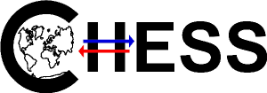

<!-- no page number on cover -->
\pagenumbering{gobble}

```{r}
#| label: setup
#| include: false

knitr::opts_chunk$set(
  collapse = TRUE,
  comment = "#>"
)
options(knitr.kable.NA = '')
options(tidyverse.quiet = TRUE)

my_packages <- c(
    "tibble",
    "googlesheets4",
    "plume",
    "tidyverse",
    "rticles",
    "knitr",
    "targets",
    "pakret"
)

lapply(my_packages, library, character.only = TRUE)

# to ensure that all your plots use the same color scheme, you can set them here

color_warming <- list(
    ambient = "#1A85FF",
    warming = "#D41159"
)

# set the theme and size for your figures here to ensure something homegeneous, and big enough
theme_set(theme_bw(base_size = 24))
update_geom_defaults("point", list(size = 2))
update_geom_defaults("line", list(linewidth = 2))

```



<!-- some white space to anchor the vspace or vfill below to place the quote -->
` `
\vfill
<!-- \vspace{3cm} -->


> Inpiration quote. Or nothing. We won't judge.

\vspace{1cm}

About the quote.


\vfill



<!-- we start counting pages from now -->
\setcounter{page}{0}
<!-- and we want Roman number for the first part -->
\pagenumbering{Roman}

<!-- latex is struggling with the links to the sections when we play with page numbering. Adding phantom sections helps. -->
\phantomsection
# Scientific environment {.unnumbered}

List funding sources

\vspace{2cm}

<!-- add logos if relevant -->

::: {layout="[ 50, 50 ]"}

{width=180 fig-align="center"}

{width=180 fig-align="center"}

{width=180 fig-align="center"}

{width=180 fig-align="center"}

:::



\phantomsection
# Acknowledgements {.unnumbered}

Don't forget to thank your office mates.

\lipsum




\phantomsection
# Abstract {.unnumbered}

\lipsum



\phantomsection
# Sammendrag {.unnumbered}

\lipsum



\phantomsection
# List of Publications






\phantomsection
## Authors contribution


According the the CRediT taxonomy [@credit2022].

```{r}
#| label: contributions
#| include: false

authors_tbl <- tar_read(contrib_tbl)
authors <- tar_read(all_authors)

```

```{r}
#| results: asis
#| tbl-colwidths: [30, 30, 30]

kable(authors_tbl)
```


\phantomsection
## Co-authors affiliations {.unnumbered}

```{r}
#| label: authors
#| include: false


aut <- Plume$new(authors)

```

`r aut$get_author_list("^a^")`

```{r}
#| results: asis
aut$get_affiliations() |> cat(sep = "\n\n")
```


<!-- Table of contents is added here -->
\tableofcontents

<!-- we restart the page and section count -->
\setcounter{section}{0}
\setcounter{page}{0}
<!-- and for the main course we want arabic number -->
\pagenumbering{arabic}

\phantomsection
# Introduction

We write smart things and we cite stuff [@corriher2008bakewise].

Inline @lee2012literature blablabla.

Or just the year -@barham2001science and nothing else.

We can also cite a paper where we are co author [@delatourte2025] and the name will not be in bold in the references list.

\phantomsection
# Aims of this thesis

\lipsum

\phantomsection
# Section


\lipsum

You can use the normal quarto and \LaTeX ways to include figures, code chunks, links, or other things.
Here I just provide an example (@fig-caption-on-side) where the figure is small and we want the caption on the side to organise the page better.

::: {#fig-caption-on-side fig-env="SCfigure" fig-pos =""}
  ```{=latex}
  \includegraphics[width=0.5\textwidth]{figures/crazy_pie.jpeg} 
  ```
  My partner made that one, just saying.
:::

<!-- described here https://stackoverflow.com/questions/77289063/how-can-i-place-the-figure-caption-next-to-the-figure-in-quarto-pdf-format#77293988 -->

\phantomsection
# R packages used in my work

Package developers invest a lot of time in those, please cite them ;)

```{r}
#| label: pakret-settings

pkrt_set(pkg = "`:pkg` R package [:ref]") # removing version numbers from package references (it will be in the list at the end)
pkrt_set(pkg_list = "`:pkg` :ver [:ref]")

```

We can do that with the `r pkrt("pakret")`.

R package used in this template repo:
`r pkrt_list(
  "tibble",
  "googlesheets4",
  "plume",
  "tidyverse",
  "rticles",
  "knitr",
  "targets",
  "quarto",
  "pakret"
)`

\phantomsection
# References {.unnumbered}

\small
::: {#refs}
:::
\normalsize



\phantomsection
# Paper I {.unnumbered}

<!-- we can keep this as comments to make it lighter -->
<!-- pages={-} means that the page numbers of the thesis will not be printed on the paper (but you do what you want) -->
<!-- \includepdf[pages={-}]{papers/paper1.pdf} -->

\phantomsection
# Paper II {.unnumbered}

<!-- we can keep this as comments to make it lighter -->
<!-- \includepdf[pages={-}]{papers/paper2.pdf} -->




\pagenumbering{gobble}

<!-- invisible space to anchor the vfill -->
` `
\vfill

\begin{flushright}
\textit{Closing word. Or nothing.}
\end{flushright}
